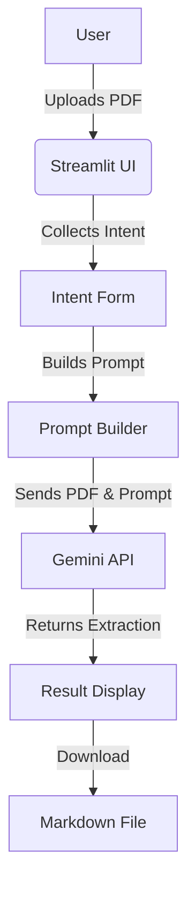
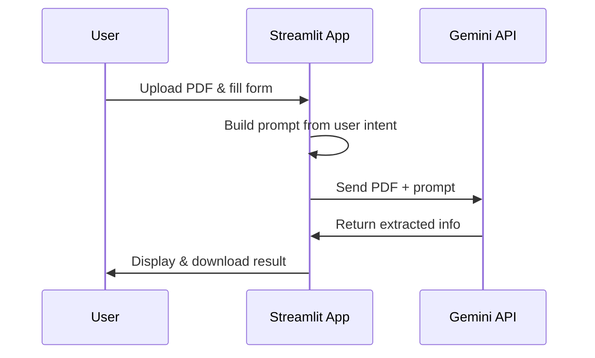

# Smart PDF Extractor
---

## 🚀 Overview

Smart PDF Extractor is an AI-powered Streamlit app that lets you upload a PDF and extract exactly the information you need, in your preferred format. Powered by Google Gemini 2.5 Flash, it provides flexible, accurate, and user-friendly document analysis for any use case.

---

## 🧩 Features

- **PDF Upload**: Drag and drop your PDF for instant analysis.
- **Custom Extraction Goals**: Describe what you want to extract in plain language.
- **Entity Selection**: Specify fields/entities to extract (e.g., Invoice Number, Total Amount).
- **Output Styles**: Choose from bullet list, numbered list, table, paragraph summary, or JSON.
- **Extra Instructions**: Add notes (e.g., currency conversion, page references).
- **AI-Powered Extraction**: Uses Gemini 2.5 Flash for accurate, context-aware results.
- **Download Results**: Save extracted info as Markdown.
- **Session State**: Seamless user experience with persistent form data.

---

## 🖼️ Architecture



---

## 🛠️ Installation

1. **Clone the repo**
   ```bash
   git clone https://github.com/aabdullah27/AI-PDF-Extractor.git
   cd AI-PDF-Extractor
   ```
2. **Install dependencies**
   ```bash
   uv sync
   ```
3. **Set up your Google API key**
   - Create a `.env` file in the project root:
     ```env
     GOOGLE_API_KEY=your_google_api_key_here
     ```

---

## ▶️ Usage

```bash
streamlit run main.py
```

1. Upload a PDF file.
2. Fill out the extraction form (goal, entities, style, notes).
3. Click **Extract Information**.
4. View and download results.

---

## 🧠 How It Works



---

## 📦 File Structure

```
AI-Doc-Feild-Extractor/
├── main.py            # Streamlit app
├── requirements.txt   # Python dependencies
├── pyproject.toml     # Project metadata
├── README.md          # This file
├── uv.lock            # Dependency lock
```

---

## 📝 Example Prompt

> "Find all financial figures and summarize them in a table. Extract Invoice Number, Total Amount, Due Date, Customer Name. Convert all currencies to USD."

---

## 📧 Contact
- [Owner: aabdullah27](https://github.com/aabdullah27)
